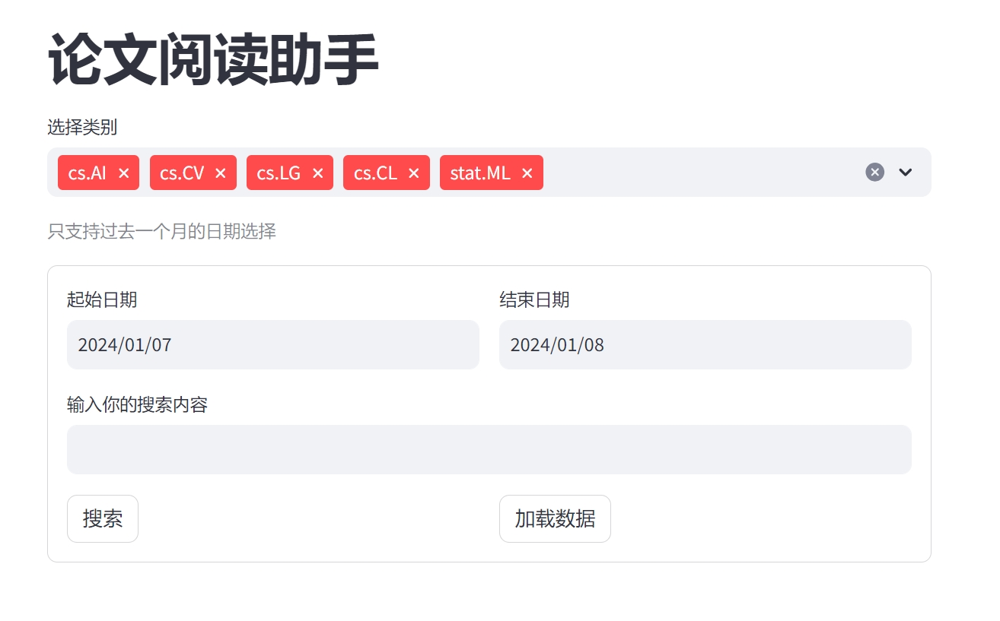

# 论文阅读助手

1. 能自动获取指定类别，指定日期范围的arxiv论文数据
2. 支持embedding的query-title的检索

# RUN

1. [download ranker model](https://huggingface.co/BAAI/bge-reranker-large), 将下载好的模型放置到项目路径下，也可以自行选择是否使用其他的模型。
2. 创建本地缓存目录 `mkdir cache_data`
3. `pip install -r requirements.txt` 可自定切换国内源
4. 如果未在本地部署大模型，则修改`paper_reader/load_data.py`，将`paper_data_obj = PaperData(use_llm=False)`
5. `streamlit run app.py`

